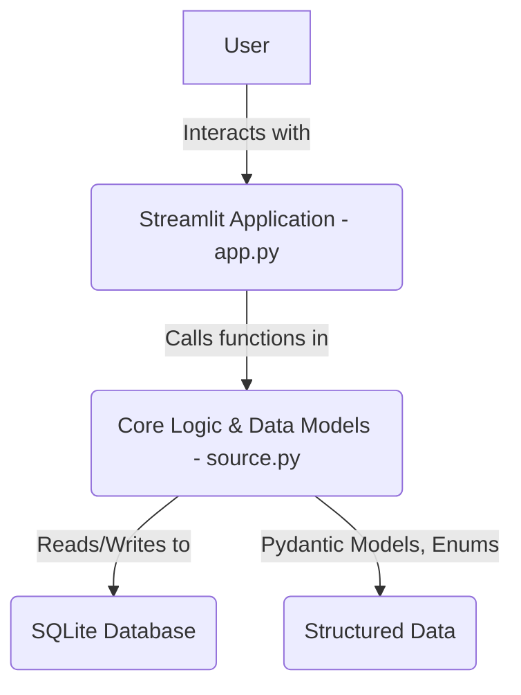

id: 6966a237c45cd9e54065d14c_documentation
summary: Enterprise AI Inventory + Risk Tiering + Lifecycle Risk Map Documentation
feedback link: https://docs.google.com/forms/d/e/1FAIpQLSfWkOK-in_bMMoHSZfcIvAeO58PAH9wrDqcxnJABHaxiDqhSA/viewform?usp=sf_link
environments: Web
status: Published
# QuLab: Enterprise AI Governance with Streamlit

## 1. Introduction to QuLab and Setup
Duration: 0:10

<aside class="positive">
  This codelab will guide you through building and understanding <b>QuLab</b>, a comprehensive Streamlit application designed for Enterprise AI Governance. We'll explore how to manage AI system inventory, perform deterministic risk tiering, track lifecycle risks, and generate auditable evidence packages.
</aside>

In today's rapidly evolving AI landscape, organizations face increasing pressure to govern their AI systems effectively. This involves understanding what AI models are deployed, assessing their inherent risks, managing risks throughout their lifecycle, and maintaining auditable records. QuLab addresses these challenges by providing a user-friendly interface powered by Streamlit, backed by robust data models using Pydantic, and persistent storage via SQLite.

This application highlights several key concepts:

*   **AI System Inventory:** A centralized repository for metadata about all AI systems, serving as the "single source of truth."
*   **Deterministic Risk Tiering:** An objective, rule-based approach to classify AI systems based on their characteristics (e.g., decision criticality, data sensitivity) into risk tiers (Tier 1: High, Tier 2: Medium, Tier 3: Low). The core formula is typically an aggregation of scores based on various dimensions: $$S = \sum_{d \in D} \text{points}(d)$$ where $S$ is the total score and $d$ represents a risk dimension.
*   **Lifecycle Risk Management:** Identifying, assessing, and mitigating risks that emerge across different phases of an AI system's lifecycle (e.g., Inception, Development, Deployment, Monitoring). Risk severity is often calculated as: $$\text{Severity} = \text{Impact} \times \text{Likelihood}$$
*   **Traceable Evidence Package:** Generating immutable records of AI system data and risk assessments, complete with cryptographic hashes (SHA-256) for auditability and compliance. The evidence hash is typically derived as: $$\text{EvidenceHash} = \text{SHA256}(\text{Artifacts})$$

### Application Architecture

The QuLab application follows a typical web application architecture with a clear separation of concerns:

*   **Streamlit Frontend (app.py):** Handles the user interface, manages session state, and orchestrates user interactions.
*   **Core Logic (source.py):** Contains the business logic, Pydantic data models for structured data, enums for categorization, and database interaction functions.
*   **SQLite Database:** A lightweight, file-based database used for persistent storage of AI system metadata, risk tiering results, and lifecycle risk entries.

Here's a simplified architecture diagram:



### Setup Instructions

To run QuLab, you'll need Python installed and the following libraries:

1.  **Create a virtual environment (recommended):**
    ```bash
    python -m venv qu_env
    source qu_env/bin/activate # On Windows: .\qu_env\Scripts\activate
    ```

2.  **Install dependencies:**
    ```bash
    pip install streamlit pandas pydantic uuid json # sqlite3 is built-in with Python
    ```
    <aside class="negative">
      The `source.py` file containing the Pydantic models and backend logic is critical for this application. Please ensure you have this file in the same directory as `app.py`. For the purpose of this codelab, we will assume `source.py` exists with the necessary Pydantic models, enums, and CRUD operations as inferred from `app.py`.
    </aside>

3.  **Save the provided application code as `app.py` and the backend logic (if provided separately, or assume its existence) as `source.py` in the same directory.**

4.  **Run the Streamlit application:**
    ```bash
    streamlit run app.py
    ```
    This will open the application in your web browser.

## 2. Exploring the AI System Inventory
Duration: 0:15

The "Inventory Management" page is your central hub for cataloging all AI systems within your enterprise. It's crucial for maintaining an accurate and up-to-date record of deployed AI assets.

1.  **Navigate to Inventory Management:**
    Ensure "Inventory Management" is selected in the sidebar navigation.

2.  **Loading Sample Systems:**
    To quickly populate the inventory, click the **"Load Sample Systems"** button. This will add predefined AI systems to your database.
    
    ```python
    if st.button("Load Sample Systems", help="Load predefined sample AI systems into the inventory."):
        load_sample_systems_data() # Function from source.py
        refresh_systems()
        refresh_tiering_result()
        refresh_lifecycle_risks()
        st.success("Sample systems loaded successfully!")
        st.rerun()
    ```
    <aside class="positive">
      Loading sample data is a great way to explore the application's features without manually entering data. The `st.rerun()` call ensures the UI updates immediately after data changes.
    </aside>

3.  **Adding a New System:**
    Click **"Add New System"** to open a form. This form collects essential metadata about an AI system, corresponding to the `SystemMetadata` Pydantic model in `source.py`.

    *   Fill in details like `Name`, `Description`, `Domain`, `AI Type`, `Owner Role`, `Deployment Mode`, `Decision Criticality`, `Automation Level`, and `Data Sensitivity`.
    *   `External Dependencies` can be entered as a comma-separated list.
    *   Click **"Save System"** to add it to the inventory or **"Cancel"** to discard.

    ```python
    if st.button("Add New System", help="Click to open a form to register a new AI system."):
        st.session_state['editing_system'] = SystemMetadata(
            name="", description="", domain="", ai_type=AIType.ML, 
            owner_role="", deployment_mode=DeploymentMode.INTERNAL_ONLY, 
            decision_criticality=DecisionCriticality.LOW, 
            automation_level=AutomationLevel.ADVISORY, 
            data_sensitivity=DataSensitivity.PUBLIC
        )
        st.session_state['system_form_key'] += 1 # Forces form redraw
        st.rerun()
    # ... form submission logic ...
    ```

4.  **Viewing the Current Inventory:**
    Below the forms, you'll see a table displaying all registered AI systems. This table provides a high-level overview, including `name`, `domain`, `ai_type`, `owner_role`, `decision_criticality`, and `updated_at`.

    ```python
    df = pd.DataFrame(data_list)
    st.dataframe(df[['name', 'domain', 'ai_type', 'owner_role', 'decision_criticality', 'updated_at']], use_container_width=True)
    ```

5.  **Editing and Deleting Systems:**
    *   Use the **"Select System to Edit/Delete"** dropdown to choose a specific system.
    *   Click **"Edit Selected"** to pre-populate the "Add/Edit System" form with the chosen system's data. Make your changes and click "Save System".
    *   Click **"Delete Selected"** to remove the system permanently from the inventory.

    ```python
    # Logic for selecting and buttons
    if c_e.button("Edit Selected"):
        obj = get_system(uuid.UUID(sel_sys))
        st.session_state['editing_system'] = obj
        st.session_state['system_form_key'] += 1
        st.rerun()
    if c_d.button("Delete Selected"):
        delete_system(uuid.UUID(sel_sys))
        st.success("System deleted.")
        # ... refresh states ...
        st.rerun()
    ```
    <aside class="negative">
      Deleting a system is irreversible. Ensure you select the correct system before proceeding.
    </aside>

## 3. Understanding Deterministic Risk Tiering
Duration: 0:15

The "Risk Tiering" page allows you to objectively classify AI systems based on their inherent risk. QuLab employs a **deterministic tiering algorithm** to ensure consistent and auditable risk classifications.

1.  **Select an AI System:**
    From the sidebar, under "Selected AI System", choose one of your registered AI systems. The tiering process applies to the currently selected system.

2.  **Initiate Risk Tier Calculation:**
    Click the **"Compute Risk Tier"** button. The application will analyze the selected system's metadata (e.g., `decision_criticality`, `automation_level`, `data_sensitivity`, `deployment_mode`, `ai_type`) and apply the predefined scoring logic from `source.py`.

    ```python
    st.subheader(f"System: {curr_sys.name}")
    st.markdown(r"$$S = \sum_{d \in D} \text{points}(d)$$")
    st.markdown(f"The total score (S) is compared to predefined thresholds to assign the risk tier. A higher score indicates higher inherent risk.")
    
    if st.button("Compute Risk Tier"):
        res = calculate_risk_tier(curr_sys) # Function from source.py
        save_tiering_result(res)
        st.session_state['tiering_result'] = res
        st.success(f"Risk tier calculated and saved for {curr_sys.name}!")
        st.rerun()
    ```

3.  **Interpreting the Result:**
    *   **Risk Tier and Total Score:** The calculated `Risk Tier` (e.g., Tier 1, Tier 2, Tier 3) and the `Total Score` (S) will be displayed.
    *   **Score Breakdown:** A detailed breakdown of points contributed by each dimension (e.g., Decision Criticality, Data Sensitivity) is shown in a table, providing transparency into how the total score was derived.

4.  **Adding Justification and Controls:**
    Even with deterministic tiering, context is crucial. You can add a `Justification` for the tier assignment and list `Required Controls` to mitigate the identified inherent risks.

    *   Enter text in the `Justification` text area.
    *   Enter `Required Controls`, one per line.
    *   Click **"Save Changes to Tiering Result"** to persist these updates.

    ```python
    with st.form("tier_edit"):
        just = st.text_area("Justification for this tier assignment:", value=res.justification)
        ctrls_str = "\n".join(res.required_controls)
        ctrls_edit = st.text_area("Required Controls (one per line):", value=ctrls_str)
        
        if st.form_submit_button("Save Changes to Tiering Result"):
            # ... update logic ...
            save_tiering_result(new_res)
            st.session_state['tiering_result'] = new_res
            st.success("Tiering result updated successfully.")
            st.rerun()
    ```

## 4. Managing Lifecycle Risks
Duration: 0:20

The "Lifecycle Risk Register" is where you document and manage risks that can arise at various stages of an AI system's lifecycle.

1.  **Select an AI System:**
    As with risk tiering, ensure you have an AI system selected in the sidebar to view and manage its associated lifecycle risks.

2.  **Understanding Risk Severity:**
    The application calculates risk severity using the formula: $$\text{Severity} = \text{Impact} \times \text{Likelihood}$$
    *   **Impact:** How severe the consequences would be if the risk materializes (1=Low, 5=High).
    *   **Likelihood:** How probable it is for the risk to materialize (1=Rare, 5=Frequent).

3.  **Adding a New Risk:**
    Click the **"Add New Risk"** button to open a form for documenting a new lifecycle risk.

    *   Choose the **Lifecycle Phase** (e.g., Inception, Development, Deployment, Monitoring) and **Risk Vector** (e.g., Functional, Performance, Data Privacy).
    *   Set **Impact** and **Likelihood** using the sliders, observing the dynamically calculated `Severity`.
    *   Provide a clear **Risk Statement**, a **Mitigation Strategy**, and the **Risk Owner Role**.
    *   You can also add `Evidence Links` (comma-separated URLs) to supporting documentation.
    *   Click **"Save Risk"** to add it or **"Cancel"** to discard.

    ```python
    if st.button("Add New Risk"):
        st.session_state['editing_risk'] = LifecycleRiskEntry(
            system_id=uuid.UUID(st.session_state['selected_system_id']),
            lifecycle_phase=LifecyclePhase.INCEPTION,
            risk_vector=RiskVector.FUNCTIONAL,
            risk_statement="", impact=1, likelihood=1, mitigation="", owner_role="",
        )
        st.session_state['risk_form_key'] += 1
        st.rerun()
    # ... form submission logic ...
    ```

4.  **Viewing Existing Risks:**
    All documented risks for the selected system are displayed in a table, showing key attributes like `risk_statement`, `lifecycle_phase`, `risk_vector`, `impact`, `likelihood`, `severity`, `owner_role`, `mitigation`, and `created_at`.

    ```python
    df_display = df_r[['risk_statement', 'lifecycle_phase', 'risk_vector', 'impact', 'likelihood', 'severity', 'owner_role', 'mitigation', 'created_at']]
    st.dataframe(df_display, use_container_width=True, hide_index=True)
    ```

5.  **Editing and Deleting Risks:**
    *   Use the **"Select a Risk to Edit or Delete"** dropdown to choose a specific risk entry. The dropdown displays a snippet of the risk statement for easy identification.
    *   Click **"Edit Selected Risk"** to load the risk's details into the form for modification.
    *   Click **"Delete Selected Risk"** to remove the risk from the register.

    ```python
    if ce.button("Edit Selected Risk"):
        obj = get_lifecycle_risk(uuid.UUID(sel_r_id))
        st.session_state['editing_risk'] = obj
        st.session_state['risk_form_key'] += 1
        st.rerun()
    if cd.button("Delete Selected Risk"):
        delete_lifecycle_risk(uuid.UUID(sel_r_id))
        refresh_lifecycle_risks()
        st.success("Risk deleted successfully.")
        st.rerun()
    ```

6.  **Lifecycle Phase x Risk Vector Matrix:**
    At the bottom of the page, a matrix visualizes the distribution of risks across different lifecycle phases and risk vectors. This provides a quick overview of which areas require more attention. The matrix typically aggregates risk information, for example, by summing severities or counting risks in each cell.

    ```python
    matrix = generate_risk_matrix(uuid.UUID(st.session_state['selected_system_id'])) # Function from source.py
    if not matrix.empty:
        st.dataframe(matrix, use_container_width=True)
    ```

## 5. Generating Traceable Evidence
Duration: 0:05

The "Exports & Evidence" page allows you to generate a formal, traceable evidence package, which is crucial for audit and compliance purposes.

1.  **Provide User/Team Name:**
    Enter your "Team/User Name" in the provided text input. This name will be included in the evidence package record.

2.  **Generate Package:**
    Click **"Generate Evidence Package"**. The application will:
    *   Collect all AI system metadata, risk tiering results, and lifecycle risk entries.
    *   Organize this data into various artifacts (e.g., JSON files).
    *   Calculate SHA-256 hashes for each artifact to ensure their integrity and provide immutability.
    *   Create a manifest listing all artifacts and their corresponding hashes.
    *   Bundle everything into a ZIP file.

    The hash is calculated as: $$\text{EvidenceHash} = \text{SHA256}(\text{Artifacts})$$

    ```python
    u_name = st.text_input("Team/User Name (for evidence package record)", "AI Product Engineer Alex")
    if st.button("Generate Evidence Package"):
        if u_name:
            with st.spinner("Generating the traceable evidence package... This may take a moment."):
                try:
                    path = generate_evidence_package("case1", u_name) # Function from source.py
                    st.success(f"Evidence package successfully generated at: `{path}`")
                    # ... download button ...
                except Exception as e:
                    st.error(f"An error occurred during package generation: {e}")
            else:
                st.error("Please provide your Team/User Name to generate the evidence package.")
    ```

3.  **Download and Verify:**
    Once generated, a **"Download Evidence Package (ZIP)"** button will appear. You can download the package and inspect its contents, including the manifest file which serves as an immutable record of the data at the time of generation.

    <button>
      [Download Evidence Package (ZIP)](https://example.com/evidence.zip)
    </button>
    <aside class="positive">
      The SHA-256 hashes in the manifest allow auditors to verify that the included artifacts have not been tampered with since the package was generated.
    </aside>

## 6. Diving into the Code
Duration: 0:10

This section provides a high-level overview of how the Streamlit application `app.py` is structured and interacts with the underlying logic.

### Streamlit Session State Management

A key aspect of this Streamlit application is the extensive use of `st.session_state`. This dictionary-like object persists data across reruns of the script, allowing the application to maintain user selections, forms in editing mode, and cached data.

```python
# Initialize Session State - CRITICAL ORDERING
if 'current_page' not in st.session_state:
    st.session_state['current_page'] = "Inventory Management"

if 'selected_system_id' not in st.session_state:
    st.session_state['selected_system_id'] = None

# ... and so on for other states like 'systems', 'tiering_result', 'lifecycle_risks', 'editing_system', 'editing_risk'
```
Functions like `refresh_systems()`, `refresh_tiering_result()`, and `refresh_lifecycle_risks()` are used to update these session states whenever data changes in the database or when a new system is selected. This ensures the UI always reflects the most current data.

### Pydantic Models and Data Handling

The application heavily relies on Pydantic models (assumed to be defined in `source.py`) to structure data. These models provide data validation and serialization capabilities.

*   When retrieving data from the SQLite database, JSON strings are often deserialized back into Pydantic model instances using `model_validate_json()` (Pydantic v2).
*   When saving data, Pydantic model instances are serialized into JSON strings using `model_dump_json()` (Pydantic v2) before being stored in the database.
*   Enums (e.g., `AIType`, `LifecyclePhase`, `RiskVector`) are used to ensure valid, predefined categories for various fields. Streamlit `st.selectbox` often works with string representations of enum values, which Pydantic models then convert back to enum instances during instantiation.

```python
# Example of saving a Pydantic model instance to DB
def add_system(system_entry: SystemMetadata):
    conn = get_db_connection()
    cursor = conn.cursor()
    cursor.execute(
        "INSERT INTO systems (system_id, json, created_at) VALUES (?, ?, ?, ?)",
        (str(system_entry.system_id), system_entry.model_dump_json(), system_entry.created_at.isoformat())
    )
    conn.commit()
    conn.close()

# Example of loading from DB and validating
def get_risks_for_system(system_id: uuid.UUID):
    # ... database query ...
    json_str = row[0] # Assuming row is a tuple, row[0] is the json string
    results.append(LifecycleRiskEntry.model_validate_json(json_str))
    # ...
    return results
```

### Streamlit UI Elements and Interaction

The `app.py` code demonstrates common Streamlit patterns:

*   `st.set_page_config`: Configures the overall page layout.
*   `st.sidebar`: For navigation and system selection.
*   `st.header`, `st.subheader`, `st.markdown`: For structuring and formatting text.
*   `st.button`, `st.form`, `st.text_input`, `st.text_area`, `st.selectbox`, `st.slider`: For user input and interactions.
*   `st.dataframe`: For displaying tabular data, often converted from lists of Pydantic model instances using `pandas.DataFrame`.
*   `st.columns`: For arranging UI elements side-by-side.
*   `st.success`, `st.error`, `st.info`, `st.warning`, `st.spinner`: For providing feedback to the user.

```python
# Example of a form for adding/editing a system
with st.form(key=f"system_form_{st.session_state['system_form_key']}", clear_on_submit=False):
    st.subheader(form_title)
    c1, c2 = st.columns(2)
    with c1:
        f_name = st.text_input("Name", value=sys_edit.name)
        # ... other inputs ...
    submitted = st.form_submit_button("Save System")
    if submitted:
        # ... processing and database update ...
        st.rerun()
```

By understanding these core components and interactions, you can further extend QuLab or adapt its patterns for your own Streamlit-based governance applications.
